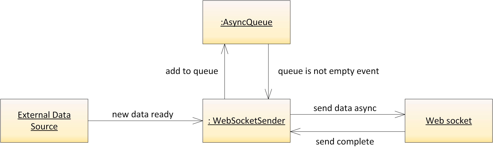

# Pushing data stream to a Web Socket using ASP.N&#8203;ET or ASP.N&#8203;ET Core
## What's in this repo
This repo contains a server that pushes a data stream, coming from a ticking timer, to a web socket, that is then consumed by a client. There are  two implementations  of the server:  ASP.N&#8203;ET and ASP.N&#8203;ET Core, and two versions of the client: a single-file JQuery and an Angular application.

See also: full blog article at https://ikriv.com/blog/?p=4643.

| Folder        | Content       |
| ------------- |-------------|
| `client\angular` | Angular 8 client, requires npm |
| `client\jquery`  | JQuery client, no dependencies |
| `server\aspnet`  | ASP.N&#8203;ET server, .NET Framework 4.5.2  |
| `server\aspnetcore`  | ASP.N&#8203;ET Core server, .NET Core 2.1  |
| `server\common`  | Common components: `WebSocketSender` and `AsyncQueue` |

## WebSocketSender Class
`WebSocketSender` class implements easy data pushing to the web socket. Data items are scheduled for sending via `QueueSend()` method, and then `WebSocketSender` writes them to the web socket in order, waking up either when the web socket finishes the write, or when the web socket is idle and more data becomes available.

It also monitors the web socket state and allows either the client or the server to close the socket gracefully.

``` csharp
dataSource.DataReady += OnDataReady;
var sender = new WebSocketSender(webSocket);
await sender.HandleCommunicationAsync(); // this task finishes when the socket is closed
...
void OnDataReady(string data)
{
   sender.QueueSend(data);
}
```

Helper class `AsyncQueue` implements task-based queue, where adding data is synchronous, and retrieving data is an awaitable task.

The communication diagram on the server side looks as follows:


## Running the sample
### ASP.N&#8203;ET Server
Open `server\aspnet\WebSocketsTest.sln` in Visual Studio and hit "Run". This automatically opens a JQuery client implemented in `index.html`. HTTP request to `api/time` returns current time as HTTP response. Web socket request to `api/time` pushes current time every second via web socket. Optional parameter `ticks` specifies how many messages to send, e.g. `api/time?ticks=3` will send three messages and then close the socket. If `ticks` is not specified, the server will send the messages indefinitely.

### ASP.N&#8203;ET Core Server
Open `server\aspnetcore\WebSocketsSrv.sln` in Visual Studio and hit "Run". .NET Core SDK 2.1 must be installed. The JQUery client is the same as for ASP.N&#8203;ET version.

### Angular 8 Client
Open `client\angular\web-socket-app` in Visual Studio code. Perform `npm install` and then `ng serve`. Specify the URL to connect to in the text boes. This client can connect to either ASP.N&#8203;ET or ASP.N&#8203;ET Core server, the communication protocols are identical. It is functionally equivalent to the JQuery client.

## In Conclusion
Web sockets are great technology, but in order to achieve the main use case they were allegedly designed for, I had to write significant amount of non-trivial boiler plate code. This was unexpected and dissapointing. Nothing like that is required on the client side in the browser: one just reads and writes data without any concern to the number of pending operations. WebSocketSender is just a sample, and it does not handle reads, but hopefully it can serve as a better starting point then the “echo” sample from the documentation. Enjoy!